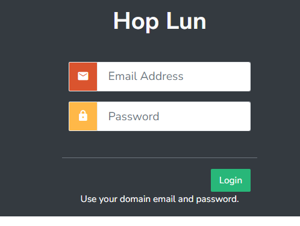
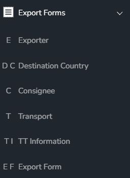
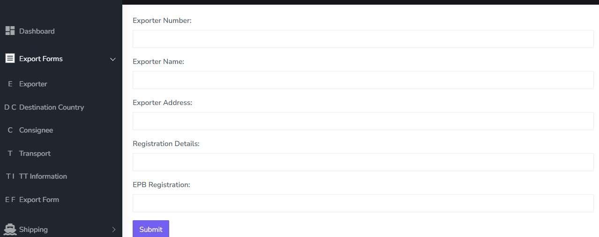
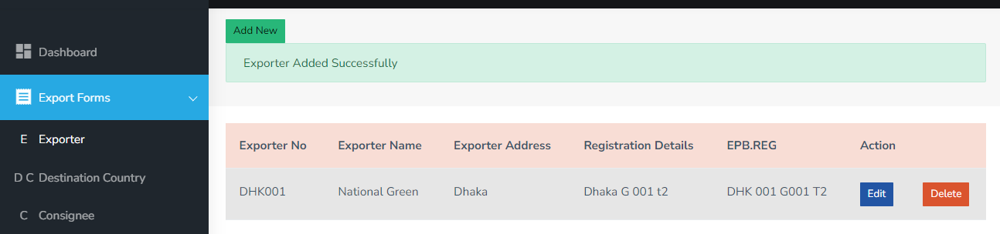
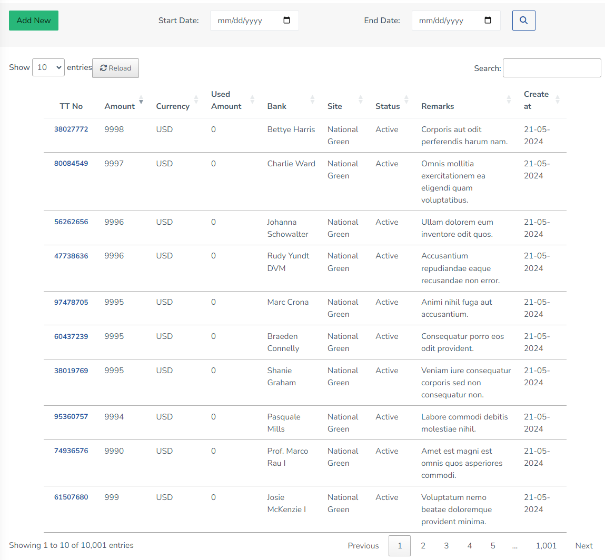

## Logistics Management Systems

For login : use mail and password

after login you can maintain the logistics management system with the following features:
you can manage Export Formms
- Exporter
- Destination Country
- Consignee
- Transport
- TT Information
- Export Form

 you can add & modify the Exporter :

 

subsequently you can add & modify the Destination Country , Consignee , Transport , TT Information and Export Form

in TT Information you can add the following information: also this is configure with yajra datatable that is able to maintain the pagination and search functionality and also you can export the data in excel and pdf format and can be handle thousands of data with the help of server side processing.

