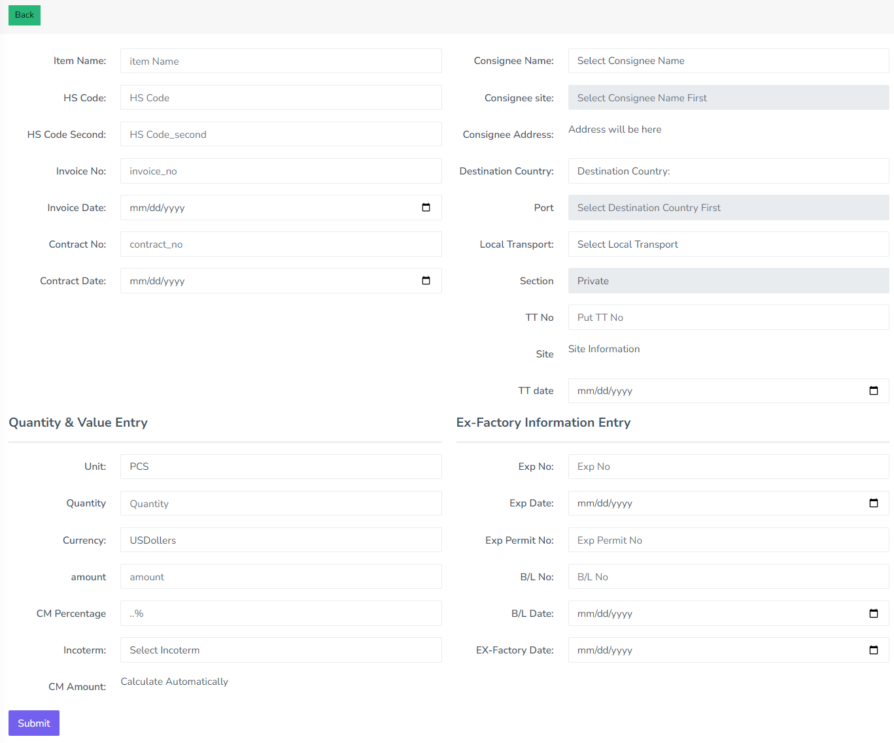

## Logistics Management Systems

<p align="center"><a href="https://laravel.com" target="_blank"></a></p>

<p align="center">
<a href="https://github.com/laravel/framework/actions"></a>
<a href="https://packagist.org/packages/laravel/framework"></a>
<a href="https://packagist.org/packages/laravel/framework"></a>
<a href="https://packagist.org/packages/laravel/framework"></a>
</p>

## Contract for more information
- Email: abusufiun27@gmail.com
- Phone: +880 1878 000 675

## Installation

1. **Clone the Repository**: 
   ```bash
   git clone https://github.com/sufiun27/Logistics_Management_Systems.git
   ```

2. **Install Composer Dependencies**: 
   ```bash
   composer install
   ```

3. **Create `.env` File**: 
   ```bash
   cp .env.example .env
   ```

4. **Generate Application Key**: 
   ```bash
   php artisan key:generate
   ```

5. **Set Up Database**: 
   - Configure your database connection details in the `.env` file.
   - Update the following variables with your database information:
     ```
     DB_CONNECTION=mysql
     DB_HOST=127.0.0.1
     DB_PORT=3306
     DB_DATABASE=your_database_name
     DB_USERNAME=your_database_username
     DB_PASSWORD=your_database_password
     ```

6. **Run Migrations and Seeders**  
   ```bash
   php artisan migrate
   php artisan db:seed
   ```

7. **Serve the Application**: 
   ```bash
   php artisan serve
   ```
<hr>

## Brief Overview

## Login
To access the system, use your email and password.


## Features
Once logged in, you can manage the logistics system with the following features:

### Export Forms Management
You can manage:
- Exporter
- Destination Country
- Consignee
- Transport
- TT Information
- Export Form


#### Exporter Management
You can add and modify exporters:


#### Destination Country, Consignee, Transport, TT Information, and Export Form Management
Similarly, you can add and modify details for Destination Country, Consignee, Transport, TT Information, and Export Form.

### TT Information
In TT Information, you can manage the following details. The system is configured with Yajra Datatables, providing pagination, search functionality, and the ability to export data in Excel and PDF formats. It can handle thousands of records with server-side processing.


### Export Form
You can manage the Export Form details with live data updates via AJAX. Yajra Datatables enable pagination and search functionality.



### Shipping Information
Manage shipping information:


### Audit Management
Handle audits with Yajra Datatables:


### Billing Details
Manage billing details:


### Logistic Details
Manage logistic details:


### Employee Authentication and Authorization
The system supports employee authentication and authorization with specific roles. You can activate or deactivate users and handle password reset functionality. You can also assign specific roles and permissions to users.


You can activate or deactivate specific roles and permissions as well.


### Reports
In the report section, you can view various reports with detailed information.

---

This README provides an overview of the features and capabilities of the Logistics Management System. For more detailed instructions on how to use each feature, refer to the respective sections above.

```
